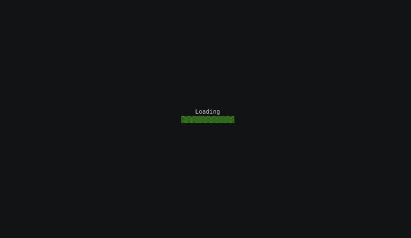

# Termloader
[](https://circleci.com/gh/bharath-srinivas/termloader/?branch=master)
[](https://godoc.org/github.com/bharath-srinivas/termloader)
[](LICENSE)

Termloader is a simple library to add a loading screen to your terminal applications. Termloader will render the 
loader at the center of your terminal screen. Currently termloader is supported only on *nix operating systems.

<p align="center">
  
  
</p>

## Installation
```bash
go get github.com/bharath-srinivas/termloader
``` 

## Example Usage
```go
package main

import (
	"time"

	"github.com/bharath-srinivas/termloader"
)

func main() {
	loader := termloader.New(termloader.CharsetConfigs["default"]) // construct a new loader with config

	loader.Start() // start the loader
	time.Sleep(5 * time.Second) // sleep for sometime to simulate a task
	loader.Stop() // stop the loader
}
```

## Loader color
```go
loader.Color = termloader.Green // provide a color for the loader (white if not provided)
```

## Provide a loading text
```go
loader.Text = "Loading" // provide a text to show above the loader
```

## Loading text color
```go
loadingText := termloader.ColorString("Now Loading", termloader.Green) // color the string
loader.Text = loadingText // provide the colored string as loading text
```

## Custom delay
```go
loader.Delay = 100 * time.Millisecond // delay in milliseconds
```

## Loading image
Termloader supports only `jpeg` and `png` formats as of now. Support for more formats might be added later.
```go
loader.Image.SetPath("/path/to/image") // provide the path of the loading image
loader.Image.SetWidth(55) // set custom width for the image
loader.Image.SetHeight(15) // set custom height for the image
loader.Image.Sharpen(6.5) // sharpens the image
```

## Provide your own character set for loader
```go
charsetConfig := termloader.CharsetConfig{Charset: []string{"|", "/", "-", "\\"}, Delay: 100 * time.Millisecond}
loader := termloader.New(charsetConfig)
```

## Todo
- [x] Loader
- [x] Optional loading text support
- [x] Optional image/icon support
- [x] Add a gif

## License
MIT